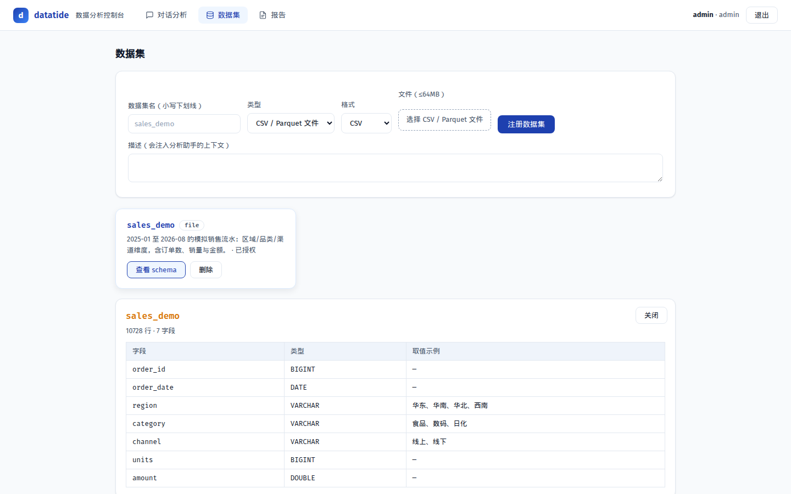
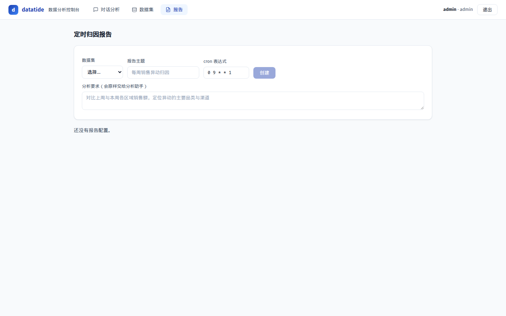

# Datatide

[](https://github.com/Yang-Shihui/datatide/actions/workflows/ci.yml)
[](LICENSE)
[](https://nodejs.org/)

**Datatide 是一个基于 Pi coding agent SDK 的自托管对话式 BI 平台。**
用自然语言查询 CSV、Parquet、Excel 和 PostgreSQL 数据，进行多步分析与归因，生成图表和定时报告。默认数据与分析服务运行在自己的机器或内网中；是否访问外部网络取决于你配置的模型和 MCP 服务。

> Datatide = data + tide：让业务数据像潮汐一样可观测、可追问、可复盘。

## 界面预览

| 对话分析 | 数据集管理 | 报告与配置 |
|:---:|:---:|:---:|
|  |  |  |
| 自然语言问数、归因、图表与导出 | Schema、前 50 行预览、授权 | 定时报告、Skills、MCP、用量与审计 |

## 已实现功能

### 对话式分析

- 自然语言问数、同比/环比、量价拆解和多步归因
- 跨多个已授权数据集 JOIN（例如销售流水 × 区域目标计算达成率）
- 流式显示思考、工具调用和回答
- `／` 技能面板：输入 `/` 后按需选择分析技能，支持鼠标、Enter、Tab、上下键和 Esc
- 消息复制、编辑重发、停止生成、智能滚动和右侧 turn 导航
- Markdown、GFM 表格、代码块和可折叠思考过程

### 图表与导出

- 柱状图、折线图、饼图和散点图
- 图表悬停下载 PNG
- 回答中的 Markdown 表格导出 CSV（带 UTF-8 BOM，适合 Excel 打开）
- 定时报告内容下载为 Markdown

> 导出功能针对分析回答中的表格、生成图表和报告，不是完整原始数据集导出。

### 数据集

- CSV、Parquet、Excel `.xlsx` 文件上传
- Excel 默认读取第一个 sheet
- PostgreSQL 只读挂载，统一通过 DuckDB 查询
- Schema 查看和数据预览（UI 默认前 50 行，API 最多 200 行）
- 管理员可在界面授权或撤销用户的数据集访问权限

### Skills 与 MCP

- 内置 5 个分析技能：归因拆解、统计口径核对、可视化选型、DuckDB SQL、Excel 分析
- 兼容标准 `SKILL.md`，可通过 `DATATIDE_SKILLS_DIR` 挂载外部技能目录
- 支持标准 `mcpServers` 配置，通过单一 `mcp` 网关调用外部 MCP 工具
- MCP 服务器启动时索引工具元数据，实际调用时按需连接；支持 stdio 和 Streamable HTTP
- 可接入 Python 沙箱、联网搜索、Excel 或其他 MCP 服务

### 账号、报告与运维

- Bearer token 登录（默认有效期 7 天）
- admin / analyst / viewer 角色和数据集级授权
- 创建、立即运行、查看历史和下载定时 Markdown 报告
- 设置页查看已加载 Skills、MCP 服务器、对话 Token 用量和审计日志
- Docker Compose 部署，支持优雅停机

## Agent 工具

默认工具：

| 工具 | 用途 |
|---|---|
| `dataset_info` | 查看当前用户可用数据集、表、字段、类型和低基数取值 |
| `query_sql` | 执行受只读守卫保护的 SELECT/WITH 查询 |
| `make_chart` | 根据分析结果生成 ECharts 图表 |
| `use_skill` | 按需加载一个 `SKILL.md` 方法论 |
| `mcp` | 通过网关列出或调用管理员配置的 MCP 工具 |

## 快速开始

### 前置条件

- Node.js ≥ 22.19，或 Docker
- 一个 OpenAI 兼容模型端点
- Pi 模型配置文件：`~/.pi/agent/models.json`

### 本地运行

```bash
npm install
cd webui && npm ci && npm run build && cd ..

# 生成并注册演示数据（包含一个可做跨数据集 JOIN 的目标表）
npx tsx scripts/gen-data.ts
npx tsx scripts/register-demo.ts

DATATIDE_MODEL=provider/model-id \
DATATIDE_ADMIN_PASSWORD=change-me \
npm run server
```

打开 <http://127.0.0.1:8200>。如果通过 `DATATIDE_ADMIN_PASSWORD` 预置了管理员，网页注册用户会成为普通 analyst；没有预置管理员时，第一个注册用户才会自动成为 admin。

Pi 模型配置使用 `~/.pi/agent/models.json` 的 provider/model 格式，API key 建议通过环境变量引用，不要写入仓库。例如：

```bash
DATATIDE_MODEL=lab/GLM-5.3-Flash npm run cli
```

### Docker

```bash
cp .env.example .env
# 编辑 .env：至少设置 DATATIDE_MODEL 和 DATATIDE_ADMIN_PASSWORD
docker compose up -d --build
```

Pi SDK 默认从容器用户的 home 目录读取模型配置。当前镜像默认以 root 运行，如需把宿主机的 `~/.pi/agent` 挂载到容器内，请在 compose 中使用：

```yaml
volumes:
  - ${HOME}/.pi/agent:/root/.pi/agent:ro
```

首次注册 PostgreSQL 或读取 XLSX 时，DuckDB 可能需要下载 `postgres` / `excel` 扩展，因此部署环境需要网络，或提前准备扩展缓存。模型和 MCP 服务是否出网取决于你的配置。

## 配置

| 变量 | 默认值 | 说明 |
|---|---|---|
| `DATATIDE_PORT` | `8200` | 服务端口 |
| `DATATIDE_MODEL` | 无 | Pi 使用的 `provider/model-id`，建议必填 |
| `DATATIDE_ADMIN_PASSWORD` | 无 | 首次启动时预置 admin 密码；仅用户表为空时生效 |
| `DATATIDE_TZ` | `Asia/Shanghai` | 定时报告 cron 时区，使用 IANA 名称 |
| `DATATIDE_DATA_DIR` | `data` | 元数据数据库和上传文件目录 |
| `DATATIDE_REPORTS_DIR` | `reports` | 报告输出目录 |
| `DATATIDE_STATIC_DIR` | `static` | 前端静态文件目录 |
| `DATATIDE_SKILLS_DIR` | 无 | 外部 `SKILL.md` 技能目录，重启后加载 |
| `DATATIDE_MCP_CONFIG` | 无 | 标准 `mcpServers` JSON 配置路径，重启后加载 |

上传通过 JSON Base64 传输：解码后文件上限为 64MB，考虑 Base64 和 JSON 请求开销，实际原文件建议控制在约 48MB 以内。

## API 概览

所有 `/api/*` 路由需要 `Authorization: Bearer <token>`。

| 路由 | 权限 | 作用 |
|---|---|---|
| `POST /auth/register` / `login` / `logout` | 公开 | 注册、登录、退出 |
| `GET /api/me` / `skills` | 已登录 | 当前用户和技能清单 |
| `GET /api/datasets` | 已登录 | 数据集列表与授权状态 |
| `POST /api/datasets` / `DELETE /api/datasets/:name` | admin | 注册/删除文件或 PostgreSQL 数据集 |
| `GET /api/datasets/:name/schema` / `preview` | 已授权 | Schema 与预览数据 |
| `GET/PUT /api/datasets/:name/access` | admin | 查看/修改数据集授权 |
| `GET /api/users` | admin | 用户列表 |
| `POST /api/chat` | 已登录 | SSE 流式分析 |
| `GET /api/sessions` / `:id/messages` | 会话所有者 | 会话与消息 |
| `PATCH/DELETE /api/sessions/:id` | 会话所有者 | 重命名/删除会话 |
| `POST /api/sessions/:id/truncate` | 会话所有者 | 回退会话分支 |
| `GET/POST /api/reports` | 已登录/授权数据集 | 报告配置与列表 |
| `POST /api/reports/:id/run` | 报告所有者或 admin | 立即运行报告 |
| `GET /api/reports/:id/runs` / `GET /api/report-runs/:id/content` | 报告所有者或 admin | 历史与内容 |
| `GET /api/usage` / `audit` / `settings` | admin | 用量、审计和系统设置 |

## 安全模型与当前限制

- Agent 不能执行任意主机代码；查询只允许单条 SELECT/WITH
- SQL 守卫拒绝 DDL/DML、PRAGMA、ATTACH、文件读取函数和未授权数据对象，并限制行数与执行时间
- PostgreSQL 通过 DuckDB `READ_ONLY` attach
- 权限目前是数据集级，不提供列级或行级权限
- SQL 守卫是词法级防护，不是完整 SQL AST 解析器
- MCP 和 Skills 是管理员配置/挂载的扩展；外部服务的网络行为由部署配置决定
- 用量统计当前记录对话分析，定时报告的独立用量需单独核算

## 开发与测试

```bash
npm test
npm run test:live   # 需要 DATATIDE_LIVE=1 和可用模型配置
npm run typecheck
cd webui && npm run dev   # Vite 开发服务器，代理到 :8200
```

当前测试基线：约 60 个 hermetic 测试，另有受环境变量门控的 live 测试；数量会随代码变化。CI 在 Node 22/24 矩阵中运行类型检查、hermetic 测试、PostgreSQL 服务测试和前端构建。

## Roadmap（公开高层方向）

- 数据质量 profiling：空值、重复、freshness、异常值和质量评分
- Dashboard：保存图表、筛选器、布局、刷新和分享
- 报告生命周期：编辑、启停、失败重试和通知
- 更多数据源：MySQL、ClickHouse、对象存储和 API
- 更完整的权限、可观测性和 UI/API 回归测试

## License

MIT
