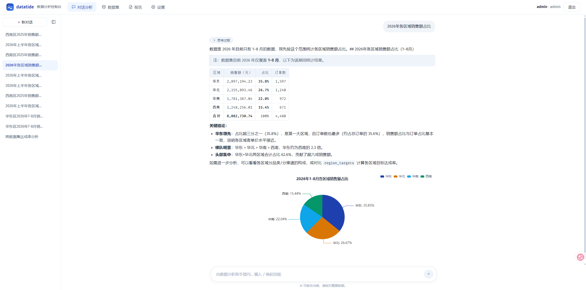

# datatide

自托管对话式 BI 平台：基于 [Pi coding agent SDK](https://github.com/badlogic/pi-mono) 构建的数据分析 agent，用自然语言问数、归因、出图、定时生成分析报告。**数据与模型调用都发生在你自己的机器/内网，不出第三方。**



## 它能做什么

- **对话分析**：agent 理解你的问题 → 查 schema → 写 SQL → 多步归因（同比/环比/量价拆解）→ 给出带口径的结论，过程流式可见
- **类 ChatGPT 对话体验**：可折叠会话侧栏、消息右下角复制/编辑重发（标准回退语义）、生成中可停止、输入 `/` 唤起分析技能面板
- **跨数据集关联**：多个授权数据集可在同一条 SQL 里 JOIN（如销售流水 × 目标表算达成率），演示数据即含此场景
- **数据管理**：注册后可预览前 50 行原始数据；admin 可视化管理数据集授权
- **图表**：分析结论自动配图（柱/线/饼/散点，ECharts 浅色主题），支持下载 PNG
- **数据源**：CSV / Parquet 文件直接上传，Postgres 只读挂载（经 DuckDB postgres_scanner ATTACH），统一一条 SQL 工具链
- **多用户权限**：数据集级授权（admin 界面勾选管理），prompt 注入 + 工具层双重强制；admin 设置页集中查看技能、MCP 状态、token 用量与审计日志
- **定时归因报告**：cron 调度 agent 无头生成 markdown 报告（如"每周一自动分析上周销售异动"）
- **结果导出**：图表下载 PNG（悬停图表）、每张结果表导出 CSV（带 BOM，Excel 直接打开）、报告下载 .md
- **分析技能（Skills）**：内置 4 个中文数据分析方法论（归因拆解/口径核对/可视化选型/SQL 方言）+ Excel 分析，agent 按问题自动加载；支持 `DATATIDE_SKILLS_DIR` 挂载外部技能目录（标准 SKILL.md 格式，兼容 Claude Code skills）
- **MCP 外部工具**：`DATATIDE_MCP_CONFIG` 指向标准 mcpServers JSON（兼容 Claude/Cursor 配置直接拷贝），单一网关工具（list/call）+ lazy 连接 + 输出截断，不撑爆上下文；例如接 `@pydantic/mcp-run-python` 即可在 Pyodide 沙箱跑 pandas 做统计检验
- **Excel 数据源**：上传 .xlsx 直接查询（DuckDB excel 扩展，取第一个 sheet）
- **只读安全守卫**：agent 生成的 SQL 经守卫层才能执行——仅允许单条 SELECT/WITH、禁 DDL/DML/PRAGMA/ATTACH、禁文件读取表函数、白名单外的数据对象一律拒绝、行数上限 + 超时中断

## 快速开始

前提：Node ≥ 22.19（本地）或 Docker；一个 OpenAI 兼容模型端点。

### 本地运行

```bash
npm install
cd webui && npm ci && npm run build && cd ..   # 构建控制台
npm run gen-data && npx tsx scripts/register-demo.ts   # 演示数据集（含归因故事线）
DATATIDE_MODEL=provider/model-id DATATIDE_ADMIN_PASSWORD=secret npm run server
# 打开 http://127.0.0.1:8200 ，admin / secret 登录
```

模型配置走 Pi SDK 约定：`~/.pi/agent/models.json`（OpenAI 兼容格式，支持 `$ENV_VAR` 注入 key），`DATATIDE_MODEL` 选 `provider/model-id`。也可以用 CLI 直接对话：`DATATIDE_MODEL=... npm run cli`。

### Docker

```bash
cp .env.example .env   # 填 DATATIDE_MODEL 与管理员密码
docker compose up -d --build
```

容器内读取模型配置需挂载 `~/.pi/agent`（compose 文件里有注释行）。

## 架构

```
浏览器 ── SSE ── Express (auth + 会话持久化 + 报告调度)
                    │
                    ▼
            Pi Agent SDK（系统提示词 = 分析师人设 + 用户权限 + 数据集快照 + 技能清单）
                    │  工具：dataset_info / query_sql / make_chart / use_skill / mcp
                    ▼
             只读 SQL 守卫（词法级白名单 + 行数上限 + 超时中断）
                    │
                    ▼
        DuckDB（文件视图） ── ATTACH READ_ONLY ──▶ Postgres
```

关键设计：

- **权限双重强制**：数据集授权既注入提示词，也在 query_sql 执行前校验表引用白名单——提示词只是软约束，守卫才是硬约束
- **报错即自纠**：守卫拒绝与 SQL 报错都会带上可操作的原因返回给模型，agent 自行修正（实测多步归因里会主动拆品类/渠道验证）
- **结构化工具而非代码沙箱**：agent 不执行任意代码，只走参数化的 SQL 路径，攻击面大幅缩小

## 安全模型与边界

v0.1 的守卫是词法级的，不是完整 SQL 解析器。已覆盖：多语句、注释/字符串伪装、`EXTRACT(... FROM ...)` 类函数参数、逗号多表引用、子查询/CTE 白名单穿透、文件与外部库表函数黑名单。Postgres 连接以 READ_ONLY ATTACH。已知边界：不支持列级/行级权限；守卫拒绝即中断（模型会自纠重试）。

## 开发

```bash
npm test          # hermetic 测试（守卫/引擎/服务端），不需要真实模型
npm run test:live # live 测试，打真实模型端到端（DATATIDE_LIVE=1 门控）
npm run typecheck
cd webui && npm run dev   # 控制台开发（代理到 :8200）
```

测试策略：hermetic 用例 + CI 矩阵（Node 22/24，含真实 Postgres service）；SQL 守卫有专项逃逸用例（PRAGMA/ATTACH/SELECT INTO/注释伪装/逗号多表/函数参数子查询）。

## License

MIT
